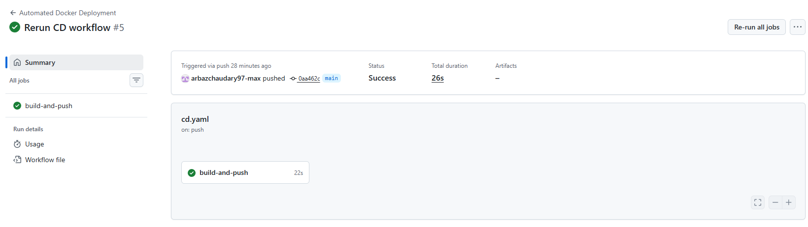
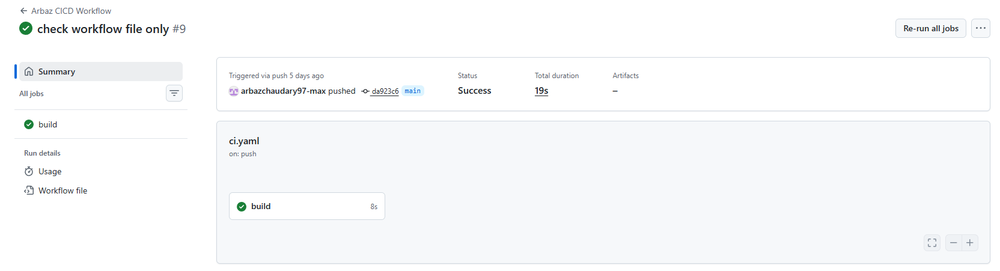
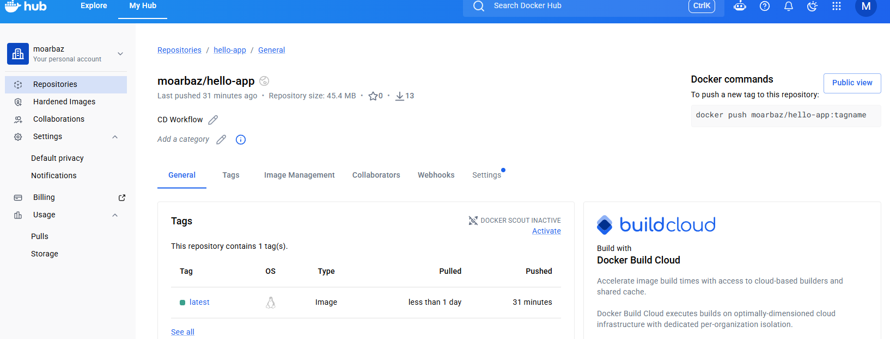

## What I built
   Task 1: CI Pipeline using GitHub Actions.
   Task 2: CD Pipeline using GitHub Actions and Docker Hub.
   Docker image automatically builds and pushes on every push to main.


## Pipeline YAML files
   .github/workflows/ci.yaml
   .github/workflows/cd.yaml

    ci.yaml – Runs automated checks on every push.
    cd.yaml – Builds and pushes Docker images to Docker Hub.

## Screenshots of Pipeline passing
    cd.yaml:
    ci.yaml:
    Docker Hub : showing latest Tag: 

## What i Learnt
   - How to create GitHub Actions workflows.
   - How to trigger workflows on pushes to the main branch.
   - How to use GitHub Secrets securely.
   - How to build Docker images using a Dockerfile.
   - How to push Docker images to Docker Hub.
   - The difference between CI and CD pipelines.

## Issues Solved

  - Workflow file was initially stored in the wrong folder.
  - YAML indentation errors caused GitHub Actions to fail.
  - Docker build failed because the Dockerfile was empty.
  - Docker Hub token had read-only permissions and could not push images.
  - Fixed Docker Hub authentication by creating a token with write permissions.

## Task 1: Basic CI Pipeline

For Task 1, I created a basic CI pipeline using GitHub Actions.

The workflow is stored in:

.github/workflows/ci.yaml

The pipeline runs automatically whenever changes are pushed to the main branch.

### What the CI pipeline does

The workflow performs basic checks to confirm that important project files exist and that the repository structure is correct.

### Trigger

The workflow is triggered on push to the main branch.

### Evidence

The workflow was tested by committing and pushing changes to GitHub. The GitHub Actions tab shows the workflow running successfully.

### Issues Faced

During this task, I had issues with the workflow file being in the wrong folder. I fixed this by moving the workflow to the correct GitHub Actions folder:

.github/workflows/

## Task 2: CD Workflow - Docker Deployment

For Task 2, I created a Continuous Deployment workflow using GitHub Actions. The purpose of this workflow is to automatically build a Docker image and push it to Docker Hub when changes are pushed to the `main` branch.

The CD workflow file is stored in:

```text
.github/workflows/cd.yaml
```

### Workflow Trigger

The workflow runs automatically when code is pushed to the `main` branch.

```yaml
on:
  push:
    branches:
      - main
```

### Job Runner

The workflow uses an Ubuntu GitHub-hosted runner.

```yaml
runs-on: ubuntu-latest
```

This means GitHub creates a temporary Ubuntu machine to run the deployment steps.

### Step 1: Checkout Repository

```yaml
- name: Checkout repository
  uses: actions/checkout@v4
```

This step downloads the repository files into the GitHub Actions runner so the workflow can access files such as `app.py`, `Dockerfile`, and `requirements.txt`.

### Step 2: Login to Docker Hub

```yaml
- name: Login to Docker Hub
  uses: docker/login-action@v5
  with:
    username: ${{ secrets.DOCKER_USERNAME }}
    password: ${{ secrets.DOCKER_TOKEN }}
```

This step logs in to Docker Hub using GitHub Secrets. The Docker Hub username and access token are stored securely as repository secrets, so they are not written directly into the workflow file.

Secrets used:

```text
DOCKER_USERNAME
DOCKER_TOKEN
```

### Step 3: Build Docker Image

```yaml
- name: Build Docker image
  run: docker build -t moarbaz/hello-app:latest .
```

This step builds the Docker image using the `Dockerfile` in the repository. The image is tagged as:

```text
moarbaz/hello-app:latest
```

The dot at the end tells Docker to use the current repository folder as the build context.

### Step 4: Push Docker Image

```yaml
- name: Push Docker image
  run: docker push moarbaz/hello-app:latest
```

This step pushes the Docker image to Docker Hub. After the workflow runs successfully, the image appears in the Docker Hub repository:

```text
moarbaz/hello-app
```

### Local Testing

Before creating the CD workflow, I tested the Docker image locally using:

```bash
docker build -t hello-app .
docker run hello-app
```

The container successfully returned:

```text
Hello, World!
```

### Outcome

The CD workflow automates the deployment process by building and pushing the Docker image to Docker Hub whenever changes are pushed to the `main` branch.
